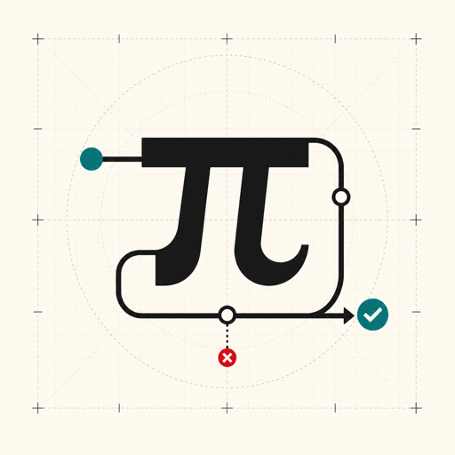

<p align="center">
  
</p>

<h1 align="center">Практический Pi</h1>

<p align="center">
  Пройдите 15 контрольных точек: начните с одной офлайн-трассировки и шаг за шагом соберите coding-агента в стиле Pi.
</p>

<p align="center">
  <a href="https://build-your-own-pi-cn.enochzhang.chatgpt.site">Читать онлайн</a>
  · <a href="https://github.com/hahhforest/pi/tree/course/build-your-own-pi/packages/pi-course">Код курса</a>
</p>

<p align="center">
  <a href="https://build-your-own-pi-cn.enochzhang.chatgpt.site">
    
  </a>
</p>

## Что это

Курс состоит из 15 запускаемых контрольных точек. Начиная с одной офлайн-трассировки агента, вы последовательно реализуете:

`протоколы TypeScript → потоковую модель → Provider → инструменты → Agent Loop → дерево сессий → сжатие контекста → расширения → Eval`

Каждая глава образует замкнутый учебный цикл из четырёх частей: **текст учебника + реальный commit + сфокусированный тест + эксперимент с отказом**. Код курса — не демонстрационный псевдокод, а полноценная история Git, которую можно checkout-нуть, запустить и проверить.

## Начало работы

Откройте [онлайн-учебник](https://build-your-own-pi-cn.enochzhang.chatgpt.site) или запустите его локально:

```bash
git clone https://github.com/Raimiz/pi-textbook-ru.git
cd pi-textbook-ru
npm install
npm run dev
```

## Учебник и код курса

| Репозиторий | Назначение |
| --- | --- |
| [`pi-textbook-ru`](https://github.com/Raimiz/pi-textbook-ru) | HTML-учебник и сайт, который вы сейчас читаете |
| [Учебная ветка `pi`](https://github.com/hahhforest/pi/tree/course/build-your-own-pi) | Запускаемый код для 15 контрольных точек; исходники курса находятся в `packages/pi-course/` |

Учебная ветка основана на зафиксированном upstream-коммите `8479bd84`. Полная история организована коммитами от `course(00)` до `course(14)`, а теги `pi-course-v1` и `course-v1/00` — `course-v1/14` фиксируют первую версию курса.

## Практика вместе с агентом

```bash
git clone --branch course/build-your-own-pi https://github.com/hahhforest/pi.git
cd pi
npm install
npm run checkpoint -w @pi/course -- 05
npm run practice -w @pi/course -- 05 ../pi-practice-05
```

Команда `checkpoint` находит parent-, target-снимок и сфокусированный тест для главы. Команда `practice` создаёт учебный каталог без ответов и истории Git. Передайте сопровождающему агенту страницу главы, вывод команд и файл `LEARNING.md` из учебного каталога.

## О проекте

Это неофициальный курс, созданный сообществом. Он не связан с Pi / Earendil Works и не представляет их интересы. Приложение и оригинальный код распространяются по лицензии MIT; текст учебника и оригинальные медиаматериалы — по CC BY 4.0; upstream-код Pi сохраняет исходную лицензию и указание авторства. Подробности см. в [`LICENSE`](LICENSE) и [`LICENSE-CONTENT`](LICENSE-CONTENT).

Инструкции по сборке, тестированию и проверке истории между репозиториями приведены в [`CONTRIBUTING.md`](CONTRIBUTING.md).

Спасибо сообществу [LINUX DO](https://linux.do/) за пространство для технического общения на китайском языке.
